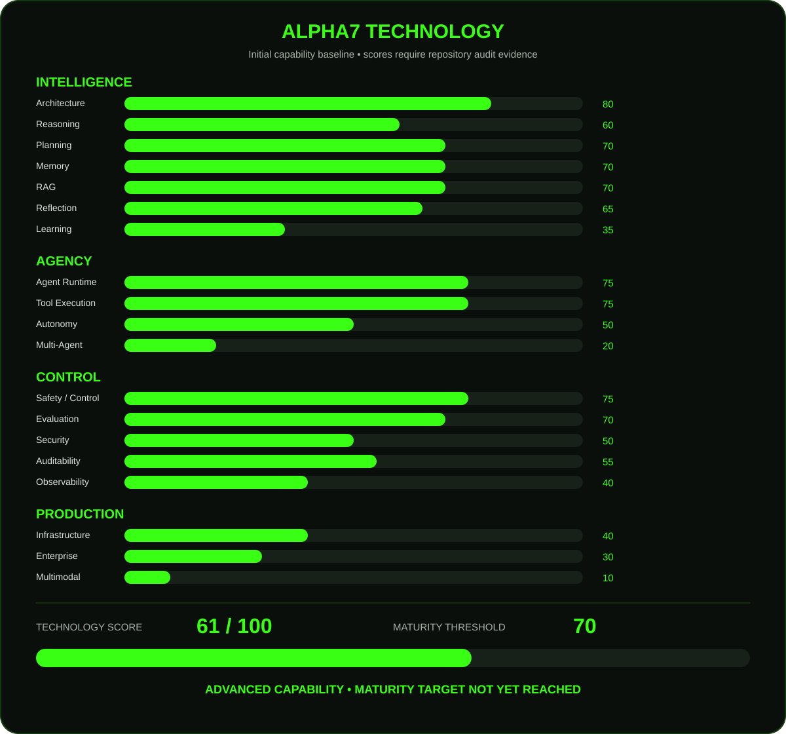

# Alpha7 Technology Battery

The Technology Battery is Alpha7's capability measurement model.

It measures technological capability rather than claiming that the agent is a percentage "intelligent".

> **Important:** The values below are an initial baseline and are not an official technical audit. Scores must be revised after a complete repository audit.



## Measurement model

Alpha7 is evaluated across four dimensions:

| Dimension | Scope |
|---|---|
| **Intelligence** | Architecture, reasoning, planning, memory, RAG, reflection and learning |
| **Agency** | Runtime, tool execution, autonomy and multi-agent capability |
| **Control** | Safety, evaluation, security, auditability and observability |
| **Production** | Infrastructure, enterprise readiness and multimodal capability |

### Initial capability baseline

| Capability | Score |
|---|---:|
| Architecture | 80 |
| Agent Runtime | 75 |
| Planning | 70 |
| Reasoning | 60 |
| Memory | 70 |
| RAG | 70 |
| Tool Execution | 75 |
| Autonomy | 50 |
| Reflection | 65 |
| Evaluation | 70 |
| Safety / Control | 75 |
| Security | 50 |
| Auditability | 55 |
| Observability | 40 |
| Multi-Agent | 20 |
| Multimodal | 10 |
| Learning | 35 |
| Infrastructure | 40 |
| Enterprise | 30 |

## Technology Score

**Initial baseline: 61 / 100**

The Technology Score is intended to represent overall technological capability. It is not a simple statement that Alpha7 is "61% complete".

## Maturity threshold

**70 / 100** is the current technology maturity threshold.

Reaching 70 means Alpha7 has crossed the defined baseline for technological maturity. It does not mean the platform is production-ready for every enterprise scenario.

## Capability Coverage

A second metric tracks the breadth of implemented capabilities:

- **Technology Score:** quality and maturity of the capabilities that exist.
- **Capability Coverage:** how much of the relevant capability surface has been implemented.
- **Maturity:** the combination of capability quality and sufficient coverage.

This prevents a highly polished subset of the system from hiding major capability gaps.

## Evolution tracking

Future releases should track the battery as a measurable progression:

```text
v0.7 → baseline
v0.8 → measured delta
v0.9 → measured delta
v1.0 → measured delta
```

Scores should only change when supported by implementation evidence, tests, benchmarks, documentation or a formal repository audit.

## Design principle

The battery is a measurement instrument, not a marketing claim.

```text
IMPLEMENTATION
      ↓
EVIDENCE
      ↓
MEASUREMENT
      ↓
TECHNOLOGY SCORE
      ↓
MATURITY
```
